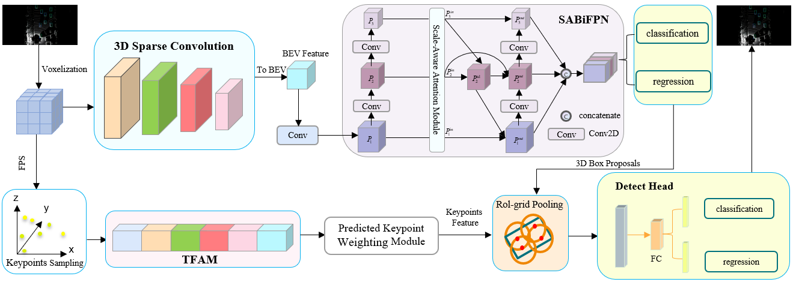

APVSA-RCNN：Adaptive Point-Voxel Attention Fusion with Scale-Aware Aggregation Network for 3D Object Detection

---

**Abstract**—Accurate 3D object detection from sparse LiDAR point clouds is critical for autonomous driving systems, yet it remains challenging due to data sparsity and feature degradation, particularly for small targets (e.g., pedestrians) and fine-grained semantic understanding. To address these limitations, we propose **APVSA-RCNN**, a two-stage real-time detection framework. First, a **Scale-Aware Bidirectional Feature Pyramid Network (SABiFPN)** is designed to enhance multi-scale feature interaction by integrating scale-specific attention mechanisms, which dynamically prioritize cross-level feature maps and strengthen contextual aggregation for enriched semantic extraction. Second, a **Triple-Modal Fusion Attention Module (TFAM)** is introduced to adaptively fuse point-wise, voxel-based, and bird’s-eye view (BEV) representations through self-attention and point-voxel cross-attention, enabling precise capture of geometric details and holistic structural patterns. Furthermore, we propose a **Rotation-Aware RDIoU Loss** to replace the conventional Smooth-L1 loss for bounding box regression, effectively resolving orientation ambiguity and improving localization robustness. Extensive experiments on the KITTI and ONCE datasets demonstrate state-of-the-art performance: APVSA-RCNN achieves **3.20%** and **1.64%** mAP improvements for pedestrians and cyclists, respectively, on KITTI, with consistent gains on ONCE. Notably, the framework maintains real-time inference at **33 FPS**, striking an optimal balance between accuracy and efficiency. These advancements highlight its potential for reliable 3D perception in autonomous driving scenarios.

**Keywords**: 3D object detection; LiDAR point clouds; Attention fusion; Scale-aware learning; Autonomous driving

---

## 1.Detection Framework

The overall detection framework is shown below.  

1. **TFAM (Tri-Modal Fusion Attention Module):** Integrates Keypoint-Voxel Cross Attention (KVCA) with self-attention
    to adaptively fuse keypoint features with voxel and BEV features for enhanced representation.  
2. **SABiFPN (Scale-Aware Attention Bidirectional Feature Pyramid Module):** Implements a scale-aware bidirectional
    feature pyramid, utilizing attention mechanisms to aggregate multi-scale features adaptively for robust proposal generation.



## 2. Recommended Environment

We have tested this project with the following environments:

- Ubuntu 20.04
- Python 3.8.12
- PyTorch 1.13.1, cuda 11.6 version
- CUDA NVCC 11.6
- Spconv 2.1.21

## 3. Installation

```bash
conda create -n SAPVCAF python=3.8
conda activate SAPVCAF
pip install -r requirements.txt
bash compile.sh
```

## 4. Prepare Data

- Please download the
  official[KITTI 3D object detection](http://www.cvlibs.net/datasets/kitti/eval_object.php?obj_benchmark=3d)dataset and
  organize the downloaded files as follows (the road planes could be downloaded
  from[[road plane]](https://drive.google.com/file/d/1d5mq0RXRnvHPVeKx6Q612z0YRO1t2wAp/view?usp=sharing), which are
  optional for data augmentation in the training):

```bash
├── data
│   ├── kitti
│   │   │── ImageSets
│   │   │── training
│   │   │   ├──calib & velodyne & label_2 & image_2 & (optional: planes)
│   │   │── testing
│   │   │   ├──calib & velodyne & image_2

# Generatedata infos:
python -m pcdet.datasets.kitti.kitti_dataset create_kitti_infos tools/cfgs/dataset_configs/kitti_dataset.yaml
```

- Please download train/val/test of the
  official[ONCE Dataset](https://once-for-auto-driving.github.io/download.html#downloads)and organize the downloaded
  files as follows:

```bash
ONCE_Benchmark
├── data
│   └── once
│       ├── ImageSets
│       │   ├── train.txt
│       │   ├── val.txt
│       │   ├── test.txt
│       │   ├── raw_small.txt    # (100k unlabeled)
│       │   ├── raw_medium.txt   # (500k unlabeled)
│       │   └── raw_large.txt    # (1M unlabeled)
│       │
│       └── data
│           └── 000000            # Sequence ID
│               ├── 000000.json     # Infos for this sequence
│               ├── lidar_roof      # Point clouds directory
│               │   ├── frame_timestamp_1.bin
│               │   └── ...
│               ├── cam01           # Camera 1 images directory
│               │   ├── frame_timestamp_1.jpg
│               │   └── ...
│               ├── cam02           # Camera 2 images directory
│               │   └── ...
│               ├── ...             # (cam03 to cam08)
│               └── cam09           # Camera 9 images directory
│                   ├── frame_timestamp_1.jpg
│                   └── ...
│           └── ...               # Other sequence directories (000001, etc.)
│
├── pcdet                       # Code library directory (e.g., OpenPCDet)
└── tools                       # Directory for scripts and tools

# Generate the data infos by running the following command:
python -m pcdet.datasets.once.once_dataset --func create_once_infos --cfg_file tools/cfgs/dataset_configs/once_dataset.yaml
```

## 5. Train

### Single GPU train

```
cd tools
python ./train.py --cfg_file ./cfgs/kitti_models/amsfn.yaml
```

### Multiple GPU train

- You can modify the gpu number in the dist_train.sh and run

```
cd tools
CUDA_VISIBLE_DEVICES=0,1,2,3 python -m torch.distributed.launch --nproc_per_node=4 train.py --cfg_file cfgs/kitti_models/amsfn.yaml --launcher pytorch
```

## 6. Evaluation

```bash
cd tools
python test.py --cfg_file ${CONFIG_FILE} --batch_size ${BATCH_SIZE} --ckpt ${CKPT}
```

## 7. FLOPs Calculation Method

- Please following [link 1](https://github.com/open-mmlab/OpenPCDet/issues/1403)
  and [link 2](https://github.com/CVMI-Lab/SparseKD/blob/master/docs/GETTING_STARTED.md) to install thop with SPCONV
  extension
- We provide an API for FLOPs Calculation

```python
from pcdet.utils.spconv_utils import spconv
from thop import profile, clever_format, profile_acts


def cal_flops(model, batch_dict):
    macs, params, acts = profile_acts(model, inputs=(batch_dict,),
                                      custom_ops={
                                          spconv.SubMConv3d: spconv.SubMConv3d.count_your_model,
                                          spconv.SparseConv3d: spconv.SparseConv3d.count_your_model,
                                          spconv.SubMConv2d: spconv.SubMConv2d.count_your_model,
                                          spconv.SparseConv2d: spconv.SparseConv2d.count_your_model}
                                      )
    return macs, params, acts

macs, params, acts = cal_flops(model, data_dict)
```

## 8. Acknowledgement

- Thanks for the [OpenPCDet](https://github.com/open-mmlab/OpenPCDet), this implementation is mainly based on the pcdet
  v0.6.0.
- Parts of our code refer to the excellent work [PV-RCNN](https://github.com/sshaoshuai/PV-RCNN)
  and [Pyramid-RCNN](https://github.com/PointsCoder/Pyramid-RCNN).

## License

This project is released under the [Apache 2.0 license](LICENSE).

## Citation

Coming soon.
